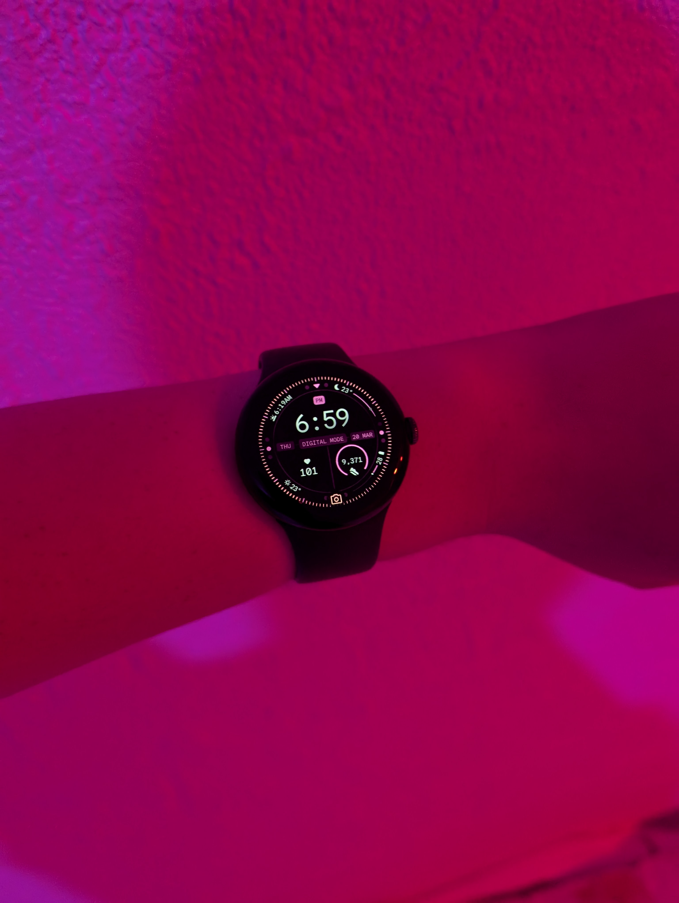
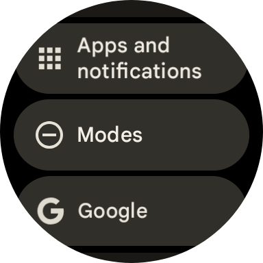
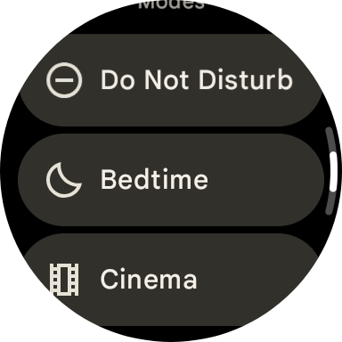
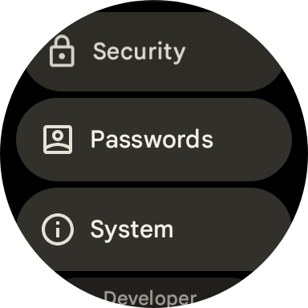
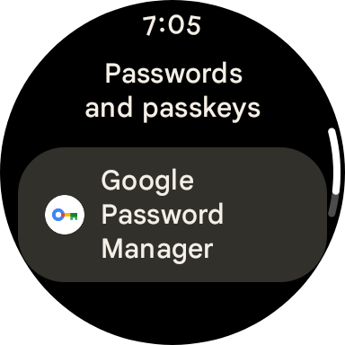
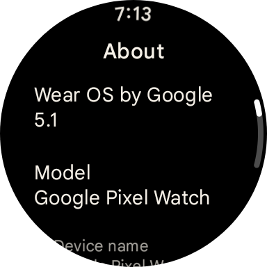

WearOS 5.1 has finally arrived for Pixel Watch first generations like mine! With it comes some much needed features & fixes including a big bug introduced 4 months ago back in November and Android 15!

## Features
The only noticeable features that instantly popped out to me are modes (consolidating Bedtime, Cinema and Do Not Disturb modes into one place, but weirdly not in the control panel) and the new passwords section in settings

WearOS 5.1 brings more than just those though, it's also supposedly bringing a more accurate step counter "for algorithm for jogging with a stroller, pushing a shopping cart or wheelchair, and hiking with poles", upgrades to media controls with control based on the type of content playing, like Android has already had for quite a bit now, such as in podcasts within YouTube Music, and the newer Pixel Watch 2 & 3 watches are getting automatic bedtime mode, while the Pixel Watch 3 gets loss of pulse detection in the US arriving later this month.

## Big fixes
WearOS 5.1 fixes a MAJOR bug in WearOS for 1st generation Pixel Watches, the font. In November, they broke the Google Sans font, causing it to use Roboto instead. This has FINALLY been fixed and Google Sans looks *so much* better than Roboto

