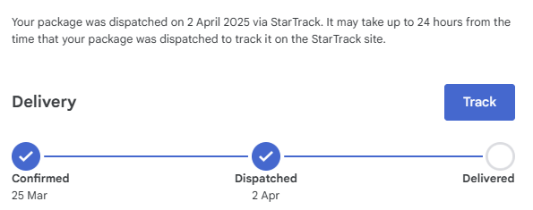

Since my Pixel 8 Pro's screen suddenly stopped working a few weeks ago and I had to switch back to my old Galaxy S9 (story for another time), I've already gotten my replacement Pixel 8 Pro from Google and wanted to share my experience with Google Support and Google Pixel warranty.

## Getting Started
As soon as I noticed that my screen was no longer working, the first thing I did was contact Google Support via their web chat. The conversation moved smoothly and the support rep started an RMA request for me (RMA stands for Return Merchandise Authorisation) so I could ship my broken phone back to Google for a replacement.

Before we get too much further, no the glass was not cracked, I did not drop the phone, the touch screen still worked but the actual OLED underneath the glass was non-functional, and also got very hot at one point, so hot a red burn mark appeared (and went away after a few minutes).

## Resetting my phone
Google's email told me to reset my phone before I shipped it to them. Understandable since they can't accept Google Account locked phones, but I didn't really have a way to reset my phone, until I realised I can connect it to my TV to see the screen. Doing so was a bit annoying, I missed the "Mirror" button in the bottom right corner due to not being able to see it twice, but after I got it I was able to see my screen and reset my phone.

It was during the time I reset my phone that the bottom of the screen got VERY hot, so hot that the red burn mark appeared on the screen, which prompted me to shut the phone down and contact Google Support yet again. This conversation didn't go as smoothly and the support rep didn't seem to understand what I was saying. I was also unable to take a photo due to not having another device with a camera at the time other than my laptop with a really bad webcam.

After about 30 minutes I gave up on the support chat and decided to just ship my phone out anyways, not my problem.

## Shipping my phone out
While I originally intended to actually go to the courier and ship my phone out, I couldn't find the time, so I arranged for pickup instead which happened the next day. I took videos of me packing the box so I had proof I did actually ship it out if needed (thankfully I didn't!).

Literally 4 hours after my phone was collected, I get an email saying they've gotten my phone and approved the warranty replacement, so I guess Google doesn't even check that I even shipped a phone because there's no way they got it from Australia to Hong Kong in 4 hours.

Google shipped the replacement phone through Australia Post, who said it would arrive in 1 day, so of course I ended up getting my phone in 5 days instead (typical Australia Post activities).

## Happy ending?
Yes! Mostly. I got my phone replaced for free under warranty, BUT, just a few days ago, I noticed an issue with the replacement, the phone had NOT been refurbished properly and the blue plastic that covers up adhesive **sticking out of the side of the phone** on the right side. This probably means whoever refurbished my specific phone was lazy and didn't bother adhering the screen down properly, at the expense of dust & water protection, so I definitely won't be trusting this phone to be so. I managed to pull most of it up and remove it using tweezers, but there's still some there.