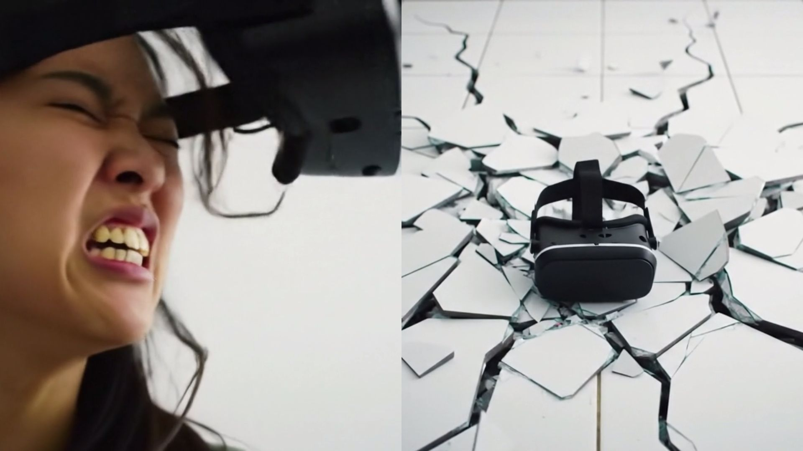
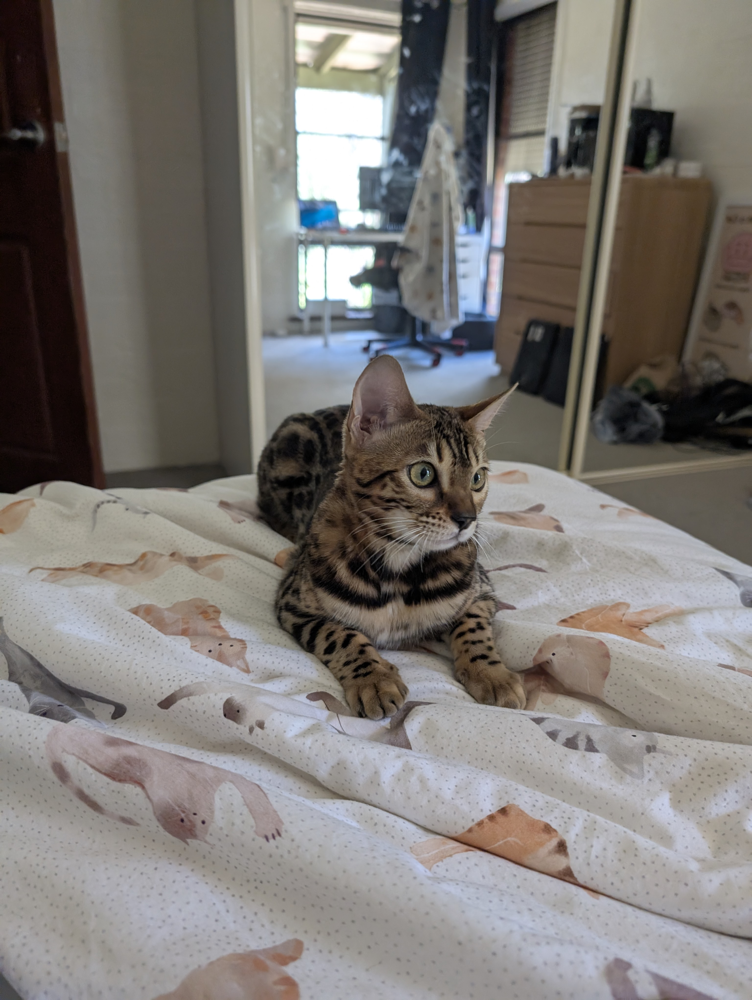

A few days ago, Google started rolling out Veo 2, their new AI Video generator to a few users, and today, I've gotten access to it.

Google first announced Veo 2 at their Cloud Next event, in which Google stated Veo 2 was ready for production & will roll out to users shortly.

Being someone with access to Veo 2, I of course had to test it, and I've put some examples down below.

Prompt: *Create a video of a man dropping his cell phone on the ground, resulting in the ground breaking*

<iframe width="560" height="315" src="https://www.youtube-nocookie.com/embed/YfKQZUmvHVE?si=ThxGuEd0rTSxpuZp" title="YouTube video player" frameborder="0" allow="accelerometer; autoplay; clipboard-write; encrypted-media; gyroscope; picture-in-picture; web-share" referrerpolicy="strict-origin-when-cross-origin" allowfullscreen></iframe>

Prompt: *Create a video of an angry man snapping his laptop in half*

<iframe width="560" height="315" src="https://www.youtube-nocookie.com/embed/kAWO_tebvj8?si=-aR2ZERoDKrekpMa" title="YouTube video player" frameborder="0" allow="accelerometer; autoplay; clipboard-write; encrypted-media; gyroscope; picture-in-picture; web-share" referrerpolicy="strict-origin-when-cross-origin" allowfullscreen></iframe>

Prompt: *Create a video of a woman ripping a virtual reality headset off of her head and throwing it on the ground, breaking both it and the tiled floor*

<iframe width="560" height="315" src="https://www.youtube-nocookie.com/embed/fpsQIsdzyYk?si=W3L9O68f94Ax2-PH" title="YouTube video player" frameborder="0" allow="accelerometer; autoplay; clipboard-write; encrypted-media; gyroscope; picture-in-picture; web-share" referrerpolicy="strict-origin-when-cross-origin" allowfullscreen></iframe>

Prompt: *Create a video of this cat jumping up and running away*

Photo given to Veo 2:

<iframe width="560" height="315" src="https://www.youtube-nocookie.com/embed/UHtQXcY14BM?si=0sxax23hwy2M-T-p" title="YouTube video player" frameborder="0" allow="accelerometer; autoplay; clipboard-write; encrypted-media; gyroscope; picture-in-picture; web-share" referrerpolicy="strict-origin-when-cross-origin" allowfullscreen></iframe>

Of course these demos aren't perfect, for example in the first video the phone bounces weirdly on the ground, in the second video the laptop appears to be 2 laptop bases and no screen?, the third video shows the headset also bouncing weirdly like the first one, making me think it doesn't quite understand gravity yet, but the scariest of them all is the 4th demo, where Veo 2 took a photo of my cat and turned it into a video, even managing to get the mirror reflection right, although it made her a lot bigger than she actully is.

Veo 2 has some limitations though. First of all, it's capped at 720p at 24fps. Furthermore, it can only generate 5-8s videos. It also costs $0.35 USD per second of video generated, placing a 5 second video at $1.75 USD while an 8 second video costs $2.80 USD. However just like other Google AI models, it's completely free to use in [Google AI Studio](https://aistudio.google.com/)

While I haven't tested it, I really do hope Google puts safeguards on Veo 2. Video generation tools are like really scary, with the rate that AI companies are developing AI at. Of course it doesn't keep going up at the same rate forever, and it also can't make fake security camera footage... yet.

Prompt: *High angle security camera shot, night time, infrared (black and white) of a middle-aged man in a jacket entering a home through the front door, a 2014 Ford Focus in the drive way*

<iframe width="560" height="315" src="https://www.youtube-nocookie.com/embed/0bhXBfctCIQ?si=_ssDiNHAed7rZo42" title="YouTube video player" frameborder="0" allow="accelerometer; autoplay; clipboard-write; encrypted-media; gyroscope; picture-in-picture; web-share" referrerpolicy="strict-origin-when-cross-origin" allowfullscreen></iframe>

