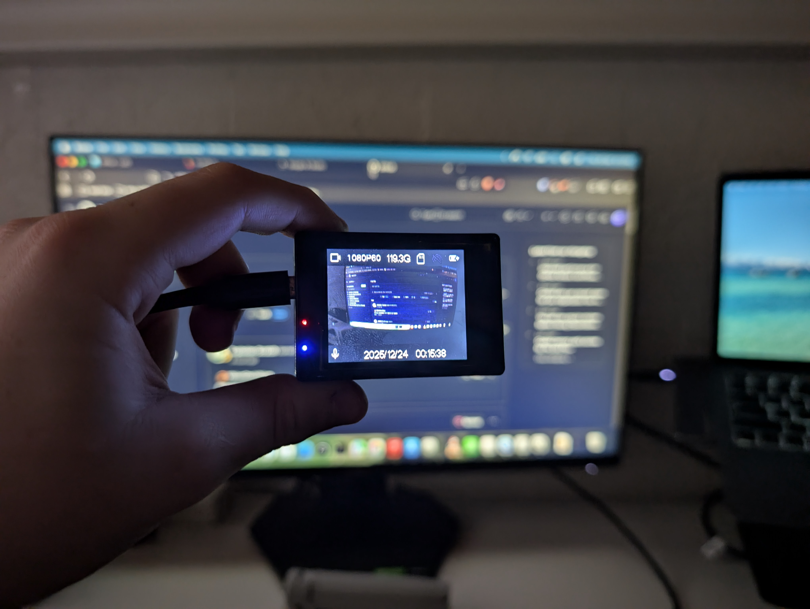

Hey everyone! Happy new year! Recently, I acquired a very strange device, a "4K" action camera that runs Android?? Kind of.

Recently, I acquired a very strange device: a "4K" action camera that runs... Android? Kind of.

The camera in question is a Cocoon 4K action camera sold by Aldi Australia back in 2019. Based on my research, these cameras have existed since 2016, and you can still find them on AliExpress and Amazon today under a dozen different names. Even "big" brands like ZERO-X sell these terrible cameras with false advertising in physical stores like JB-HiFi for upwards of $120 (which is absolutely disgusting considering they're $30 on AliExpress).

One thing is for sure: these things cannot do 4K. A lot of them don't even have the Sony sensors advertised on the box, instead rocking bottom-of-the-barrel OmniVision or GalaxyCore 4MP (or even 1MP!) sensors. But the rabbit hole goes much deeper than just fake specs.

The thing that struck me the most was that these cameras actually run Android. It's a fork called CamDroid (or CamLinux). It’s based on Android 4.2.2 with Linux Kernel 3.4, but it has had almost everything stripped out of it. No Android Framework, no Zygote, no launcher, no Java.

With only 32MB of RAM available to the OS (and another 32MB for the GPU), you're definitely not going to be running GTA San Andreas on this, but the fact that they chose Android middleware for a simple camera is fascinating and so weird at the same time.

Enough rambling though—here are my findings on my specific camera, enjoy :)

### The build.prop
```
# begin build properties
# autogenerated by buildinfo.sh
ro.build.id=JDQ39
ro.build.display.id=beike1gddrimx179spq_sdv-eng 4.2.2 JDQ39 eng.yj.20191024.142217 test-keys
ro.build.version.incremental=eng.yj.20191024.142217
ro.build.version.sdk=17
ro.build.version.codename=REL
ro.build.version.release=4.2.2
ro.build.date=2019年 10月 24日 星期四 14:22:22 CST
ro.build.date.utc=1571898142
ro.build.type=eng
ro.build.user=lzm
ro.build.host=sunchip-To-be-filled-by-O-E-M
ro.build.tags=test-keys
ro.product.model=SoftwinerEvb
ro.product.brand=softwinners
ro.product.name=beike1gddrimx179spq_sdv
ro.product.device=beike1gddrimx179spq-sdv
ro.product.board=pluto
ro.product.cpu.abi=armeabi-v7a
ro.product.cpu.abi2=armeabi
ro.product.manufacturer=unknown
ro.wifi.channels=
ro.board.platform=exDroid
# ro.build.product is obsolete; use ro.product.device
ro.build.product=beike1gddrimx179spq-sdv
# Do not try to parse ro.build.description or .fingerprint
ro.build.description=beike1gddrimx179spq_sdv-eng 4.2.2 JDQ39 eng.yj.20191024.142217 test-keys
ro.build.fingerprint=softwinners/beike1gddrimx179spq_sdv/beike1gddrimx179spq-sdv:4.2.2/JDQ39/eng.yj.20191024.142217:eng/test-keys
ro.build.characteristics=sdv
# end build properties

#
# ADDITIONAL_BUILD_PROPERTIES
#
ro.feature.http=1
sys.usb.config=mass_storage,adb
ro.font.scale=1.0
ro.hwa.force=true
rw.logger=0
ro.sys.bootfast=true
ro.cdr.debug=false
ro.aw.sensordiscard=8
ro.kernel.android.checkjni=1
net.bt.name=CamLinux
dalvik.vm.stack-trace-file=/data/anr/traces.txt
```
The name "Beike" appears everywhere. This seems to be the "Reference Design" that all these generic cameras are based on. I kinda like it so I just went with it.

### Root shell by default + adb
There is absolutely zero security. Once connected to a computer via USB, the camera shows up in `adb devices`. Running `adb shell` drops us straight into a root shell (`#`), where we can do... well, anything.

```
josh@Joshs-Air ~ % adb devices
List of devices attached
20080411	device

josh@Joshs-Air ~ % adb shell
root@camdroid:/ # 
```

### FAKE sensors
On my camera, the sensor info was hard to verify. The firmware is clearly based on the driver for an IMX179 (or 179S), but the kernel logs (and driver file name) reveal mine actually has an IMX175.

This is good for me, because the IMX175 is a real 8MP Sony sensor, but many other versions of this camera use fake upscaled sensors from OmniVision or GalaxyCore.

### Leftovers from an Android Emulator build
I don't really know what I expected from a hodge-podge incredibly stripped down Android 4.2.2 build that literally doesn't even have Android Framework itself, but I did not expect leftovers from the Android Emulator of all things. in /etc, there's an init.goldfish.sh file, a leftover from the old android virtual device emulator. It doesn't actually get executed though.

### Deleting the Chinese or English language packs breaks the XDV app
I mean the title kind of told you everything, but yeah the XDV phone app explodes if it can't download those files from the camera.

### They deep fried the camera
Except unlike McDonalds Fries, they don't look or taste good :(

It wasn't just bad, it was atrocious. Everything had black outlines, was horribly oversharpened and denoised. The cause? The Image Signal Processor (ISP) was using generic default settings with Sharpening and Denoise cranked to the max. And my solution? I injected custom ISP tuning files to turn sharpening down to almost zero. The result? Actual HD video that looks like a camera, not a painting.

## Flashing and firmware hacking (the fun part!)
While there are various other blog posts online, none of them go into flashing or firmware hacking other than one thread on the DashCamTalk forums [(https://dashcamtalk.com/forum/threads/hacking-q3h-allwinner-v3-camdroid.20507/)](https://dashcamtalk.com/forum/threads/hacking-q3h-allwinner-v3-camdroid.20507/)

Having bricked my own camera trying to flash in chunks using cat to write directly to the mtdblocks (huge mistake), and then revived it 2 days later after a LOT of painful research, I can confidently say that I know a LOT about it now.

The main tool is sunxi-tools. Allwinner chips have a hardware-level recovery mode called FEL. You enter it by holding Volume Up while plugging in the USB. It's awesome because it allows raw access to the flash chip before the OS loads. You essentially cannot "hard brick" this device as long as the CPU is alive.

There's no "partition table" so to say, but rather flashing is done at offsets, which feels sketchy until you realise that all you have to do is find the size in bytes of every mtdblock preceeding the one you're flashing and add them together, boom, there's your offset.

```bash
# flash
./sunxi-fel -p spiflash-write (offset) (image)

# restart
./sunxi-fel wdreset
```

But what's the point in flashing if you don't have anything cool to flash? That's where the firmware hacking comes in! Unlike flashing, grabbing mtdblocks is easy, since Android basically treats them like partitions, just run

```bash
adb pull /dev/block/mtdblock0
```

And repeat for mtdblock1, 2, 3, 4, 5, 6 and 7.

### The Partition Map
Through trial and error (and binwalk), I mapped the storage:

- mtdblock0 (Boot0): The the u-boot bootloader. The first 16,384 bytes are checksummed, however, the remaining 188,416 bytes, including the script.bin which allows us to change pretty much everything are not. I was able to manually enable the full 256MB of RAM by modifying my script.bin inside mtdblock0 and booted successfully.
- mtdblock1 (Kernel): The Linux Kernel and Initramfs.
- mtdblock2 (System): This is where all the fun stuff is! We can see the sdv binary which powers the entire MiniGUI-based user interface, modify the strings to fix the bad English, change the icons and so much more! This is a squashfs partition, so it is read only while booted, however using squashfs-tools we can unsquashfs it, modify it, then re-pack it and flash it to the camera.
- mtdblock3 (Data): User settings. No clue why it's 300+KB.
- mtdblock4/5 (Logos): Just raw JPEG images! mtdblock4 is the startup one, while mtdblock5 is the shutdown one. You can literally just rename these dumped files to add a .jpg to the end and open them, edit them etc.
- mtdblock6 (Env): A weird backup partition containing an archive of drivers (libvideoresizer.so).
- mtdblock7 (Private): nobody knows, it has 3 xz compressed things I haven't been assed to extract.

## The final product

- Bitrate: Unlocked from 3Mbps -> 20Mbps (Massive quality jump).
- Framerate: Unlocked true 720p 60fps (Stock 1080p60 was just upscaled 720p!).
- Audio: Fixed the gain so you can actually hear people, and silenced the startup screech.
- Heat: Fixed the "White Screen of Death" by underclocking the LCD driver (it was running the screen at 87hz for... some... reason???)
- Storage: Added support for 128GB SD Cards (using 64KB cluster formatting).

I have published my entire toolchain, including the backup scripts, flash tools, and config patches, to GitHub. If you have one of these generic cameras gathering dust, go hack it!

[GitHub: JoshAtticus/Beike-Tools](https://github.com/JoshAtticus/Beike-Tools)

See you in 2026!