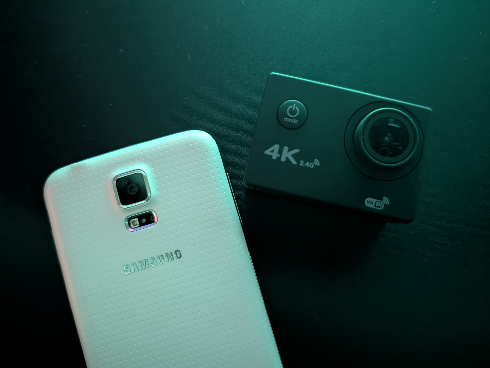

In a [previous blog post](/posts/2025-12-31-allwinner-v3-action-cameras-happy-new-year), I reverse engineered a generic Allwinner V3 action camera, discovering the partition table, how to make custom firmware etc, but I only briefly touched on the camera quality.

Since the sensor used in my specific camera, the IMX175, was released around 2014, I decided it would be fitting to compare it to a flagship phone released in 2014, the Samsung Galaxy S5. I went out with both devices and took a few photos and videos, enjoy :)

[[compare: assets/2026-01-02-cheap-action-camera-vs-galaxy-s5/flower_s5.jpg | assets/2026-01-02-cheap-action-camera-vs-galaxy-s5/flower_ac.jpg | Action Camera vs Galaxy S5 - Flower]]

[[compare: assets/2026-01-02-cheap-action-camera-vs-galaxy-s5/grassbush_s5.jpg | assets/2026-01-02-cheap-action-camera-vs-galaxy-s5/grassbush_ac.jpg | Action Camera vs Galaxy S5 - Grasstree]]

[[compare: assets/2026-01-02-cheap-action-camera-vs-galaxy-s5/leaves_s5.jpg | assets/2026-01-02-cheap-action-camera-vs-galaxy-s5/leaves_ac.jpg | Action Camera vs Galaxy S5 - Leaves & Sunset]]

[[compare: assets/2026-01-02-cheap-action-camera-vs-galaxy-s5/sky_s5.jpg | assets/2026-01-02-cheap-action-camera-vs-galaxy-s5/sky_ac.jpg | Action Camera vs Galaxy S5 - Afternoon Sky]]

[[compare: assets/2026-01-02-cheap-action-camera-vs-galaxy-s5/gumtree_s5.jpg | assets/2026-01-02-cheap-action-camera-vs-galaxy-s5/gumtree_ac.jpg | Action Camera vs Galaxy S5 - Gumtree & Sunset]]

[[compare: assets/2026-01-02-cheap-action-camera-vs-galaxy-s5/sunset_s5.jpg | assets/2026-01-02-cheap-action-camera-vs-galaxy-s5/sunset_ac.jpg | Action Camera vs Galaxy S5 - Sunset]]

[[compare: assets/2026-01-02-cheap-action-camera-vs-galaxy-s5/njuniper_s5.jpg | assets/2026-01-02-cheap-action-camera-vs-galaxy-s5/njuniper_ac.jpg | Action Camera vs Galaxy S5 - Native Juniper Plant]]

[[compare: assets/2026-01-02-cheap-action-camera-vs-galaxy-s5/alily_s5.jpg | assets/2026-01-02-cheap-action-camera-vs-galaxy-s5/alily_ac.jpg | Action Camera vs Galaxy S5 - African Lily]]

I think from these images it's quite clear which device has a better camera, the Galaxy S5. It has significantly better HDR, allowing for darker foregrounds to still show up in the picture even with a bright background, the colour tones are significantly warmer, the images are overall less sharpened, looking more natural, and the lens produces normal looking flat images, unlike the 170 degree lens of the action camera more oriented towards recording as much as possible in one frame for, well, action scenes. Do you have a different opinion? I would love to hear about it in the comments :D