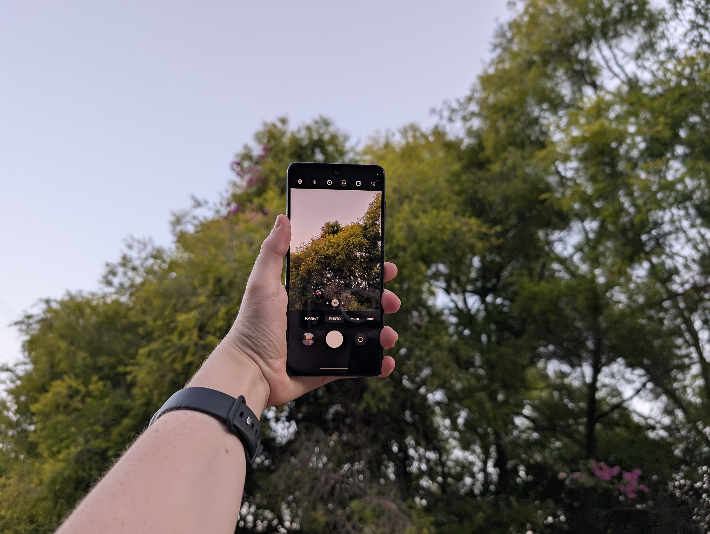
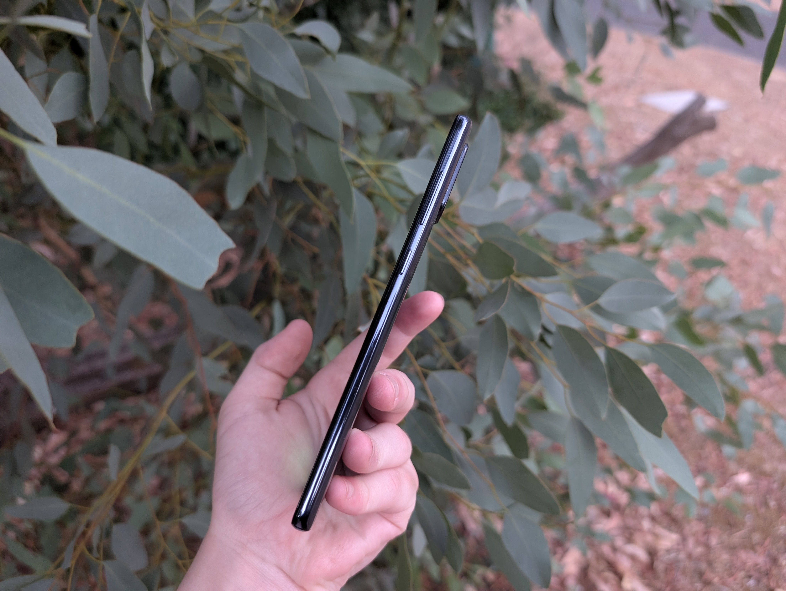
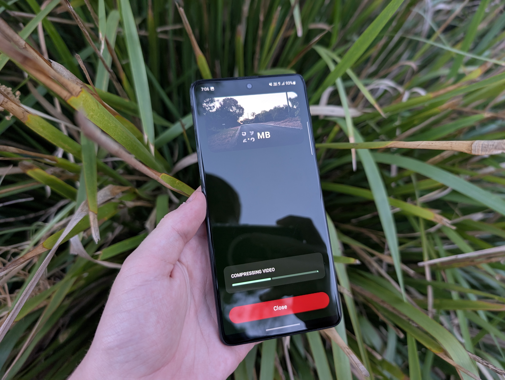
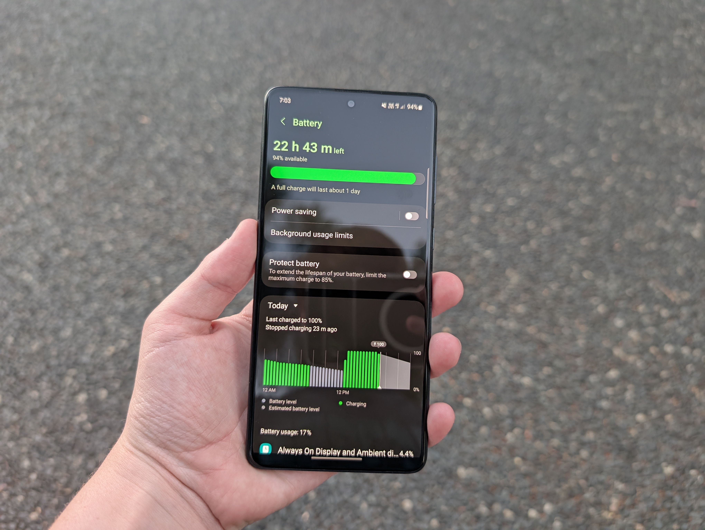
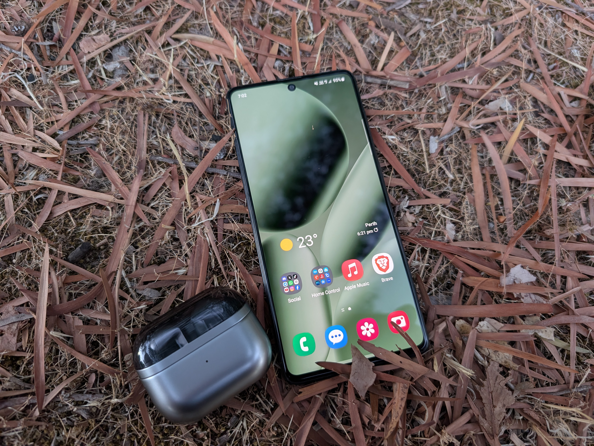

Phones have come a looooong way, even in just the past decade or so. Can you believe the first iPhone released in 2007? That's a whopping 19 years ago! In this time, phones have advanced incredibly. We've got huge screens, almost 7" on some phones, huge batteries, huge cameras, more RAM than some laptops, and even more processing power than some computers! 

It's really easy to take a modern flagship phone for granted if you have one, but what's really the difference between a modern flagship phone and a midrange phone from 6 years ago? Well I was stupid enough to find out by ditching my perfectly good Pixel 8 Pro and replacing it with a Galaxy A71 4G for a day, which was, an experience.

## First Impressions and Build Quality
I will say, for a midrange phone, it feels incredible in hand. Even though it's made of plastic, it doesn't feel cheap at all. It feels super thin in hand, has a really nice weight to it, and the slightly curved back makes it feel nicer to hold. 

Not to mention, this screen is just GORGEOUS. Samsung really does their screens well. It's genuinely the one thing I wish my Pixel had that this phone has instead. The colours are so incredibly vibrant, the contrast is just outstanding on that Super AMOLED panel, and despite only being a 60hz panel, it still feels really smooth to use. Also not that applicable to either but my Pixel has a super scratched screen protector I refuse to replace until it shatters, so switching to this super fresh screen was so nice. My finger just glides across the glass, which I haven't felt with my Pixel in a long time.

## Performance and Software
Now, this is where the phone really shows its age. The Snapdragon 730 is a decent midrange chip for its time, but compared to the Tensor G3 in my Pixel 8 Pro, it really falls behind. While yes, I did just say the screen felt really smooth, it was really only in the launcher and basic apps. As soon as I opened anything more demanding like Discord, TikTok, or even Gmail or the Camera app, the phone really struggled to keep up.

Of course I wasn't really expecting any better, the Snapdragon 730 was already dated when the Galaxy A71 released, and scores a measly 349k in AnTuTu, compared to the 1.2 million that the Tensor G3 scores. I feel like this is the biggest difference between a flagship and a midrange phone, the performance gap is just huge and it really shows in day to day use. I guess with the rest of the phone being so good, they have to cut costs somewhere so people don't just buy a midranger over a flagship.

As for video encoding and decoding (shameless plug, I tested it with my app, [Compressor](https://play.google.com/store/apps/details?id=compress.joshattic.us)), it actually works quite well! Snapdragon's hardware video encoders and decoders have always been quite good, and the Snapdragon 730 is no exception. It can compress videos in Compressor at a decent speed, in between the Galaxy S8+ and the Galaxy S10, which is pretty good for a midrange phone from 6 years ago, and it can also play back 4K videos at 30fps without any issues, which is impressive for a phone of this age.

The software was welcoming however! I'm going to be absolutely flamed for this, but I actually really like OneUI. I think it looks really good, especially with dark mode on. I love having a significantly more customisable lock screen, more blur effects present, pages on the apps screen (Google PLEASE add this to the Pixel launcher) and Samsung's apps are significantly more consistent with the rest of the OS, unlike stock Android with Google apps.

Something I DIDN'T like about the OneUI experience was the Samsung Keyboard. I don't know if it's just the version of the keyboard on this phone, but it was really bad. The most frustrating part is when it autocorrects a word incorrectly, you go back and fix it but then it just autocorrects it again, and doesn't learn, unlike Gboard which learns from your corrections. While Samsung Keyboard was smoother and more responsive than Gboard, it just was not worth dealing with terrible autocorrect, so I did end up installing Gboard pretty quickly.

I also attempted to use Samsung Wallet throughout this ordeal, but it simply refused to work. Every time I pressed the button to activate my card, it would complain about not being able to connect to the server and told me to contact support, so I just used Google Wallet instead. The only advantage Samsung Wallet previously had was switching between Eftpos and Mastercard before paying to avoid surcharges at some places, which Google Wallet now has anyways.

## Camera
I lied about performance being the only thing holding this phone back, the cameras kinda suck too. Don't get me wrong, in absolutely perfect lighting in 16MP mode, auto settings, no zoom, main camera, it takes perfectly usable photos, but the same applies to literally every other phone. 

It seems Samsung has gone out of their way to make this camera exceptionally bad however. Example A, you move close to literally anything and it force switches you to the horrid 5MP macro camera and takes an awful photo. Example B, there's a bright light source in your photo and it boosts the ISO for some reason and takes a really grainy yet somehow oversharpened photo. And even when you do have perfect lighting, zoom in just a bit and you instantly see processing artifacts and zero real detail. It's really bad.

Of course I was not expecting a 6 year old midranger to have a Pixel 8 Pro obliterating camera setup, but c'mon Samsung, even the Galaxy S9 has better cameras than this!

The cameras are partially salvageable by installing a Google Camera port... if you like waiting a minimum of 20 seconds between tapping the app icon and being able to take a photo.

It also seems to just weirdly oversaturate photos, which can look nice, but other times it just looks really unatural. The Pixel 8 Pro's photos are much more natural looking, and while they may not be as vibrant, they generally look much better in my opinion.

[[compare: assets/2026-02-18-i-used-a-6-year-old-midranger-for-a-day/galaxy-2x-zoom.jpg | assets/2026-02-18-i-used-a-6-year-old-midranger-for-a-day/pixel-2x-zoom.jpg | Pixel 8 Pro vs Galaxy A71 - 2x Zoom]]

## Battery Life
See, I was kind of expecting the battery life to be better than it was, but it was actually quite disappointing. Despite having a 4500mAh battery, a less powerful processor and a 60hz screen, it actually lasted about the same as my Pixel 8 Pro, which has a 5000mAh battery, a much more powerful processor and a 120hz screen. As far as battery guru is concerned, my battery health is at 94% too, so it's not like my battery is super degraded and unusable. I guess Samsung Foundry made chips like the Snapdragon 730 all have terrible power efficiency (come on, name ONE Samsung-made chip with good power efficiency and thermals).

It's not like I was doing anything intensive either, most of my day consisted of listing to downloaded Apple Music with my Galaxy Buds3 Pro, messaging on Discord, scrolling on TikTok and Twitter and taking a few photos, which is pretty light usage. From my previous experience with budget phones, this should've lasted days, but instead I was down to 20% by 3pm, which is not bad, but it's not great, and certainly not great considering how bad the performance is.

## Conclusion
Overall, I had a pretty fun time using the Galaxy A71 4G for a day, but it really made me appreciate how far phones have come in the past 6 years. The screen is still fantastic, the build quality is surprisingly good for a midrange phone, and the software is actually quite nice, but the performance and cameras really show their age. I don't think I could go back to using a phone like this on a daily basis, but it was definitely an interesting experience! It really made me appreciate just how good modern flagship phones are, but I definitely wouldn't choose it over an older flagship phone like the Galaxy S9 or S10, which can be had for a very similar price, but with significantly better cameras, performance, screen resolution, battery life, and quality of life features like wireless charging, water resistance (trust 6-7 year old water resistance as much or as little as you want), metal & glass frame and back, and higher quality audio via the 3.5mm headphone jack.

In the days following my experience, I have found myself carrying around both the A71 and my Pixel, using the A71 as a secondary phone for music. Unlike my Pixel, it supports Samsung Seamless Codec for my Galaxy Buds3 Pro, which has really good quality, 360 Audio, and for some reason supports Dolby Atmos in Apple Music which my Pixel 8 Pro doesn't.

