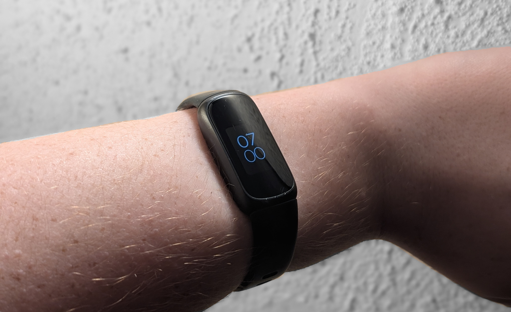

Every single day since I got my first smartwatch in 2021, I have worn one every day. At first I thought they were cool, they've got cool gimmicks, they record health data, I can see phone notifications, but slowly, I've started to realise just how pointless smartwatches seem. The whole advantage of my current one, a first generation Google Pixel Watch, is that I can install apps and stuff on it, but what's the point? My phone is right there, my phone does everything my watch does but way faster and more conveniently. It's just dead weight on my wrist that tells the time and needs charging every, single, day.

You know what doesn't though? The Fitbit Inspire 3 I stole from my brother because he never uses it. Not only does it have week long battery life, but it tells the time and records health data, all while being significantly lighter, the only things I used my Pixel Watch for! Sure, it doesn't have media controls, you know what does though? My Galaxy Buds3 Pro! and using media controls on a smartwatch is so inconvenient, I'd rather use the controls on my earbuds anyways! What about reading emails? Can't do that with a tiny little OLED screen can you? Well, I also can't do that on my Pixel Watch, because the Gmail app, only supports Gmail accounts, so I can't access my emails on my selfhosted Mailcow server. Plus, why would you *want* to read emails on your wrist, when of course, your phone is *right there*!

Then there's price. I've been holding off on upgrading my Pixel Watch because of price. What's the point of spending hundreds of dollars on a brand new smartwatch I'll play around with for a few days, before it just goes back to being a time and health thing? I don't actually personally know a single person in my life who uses their smartwatch for anything more than time and fitness, which this Fitbit Inspire 3 does for half the price. 

As for looks, I actually much prefer the smart band form factor over having a big, round glass dome on my wrist. It just looks more elegant in my opinion.

Do you own a smartwatch? If so, what do you actually use it for? I'm genuinely interested to know if I'm the only person who thinks this way about them.