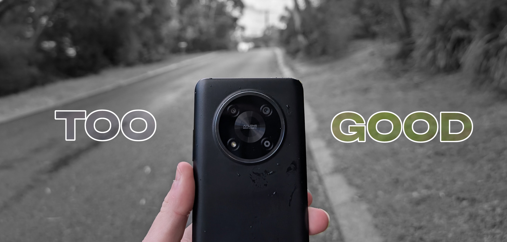
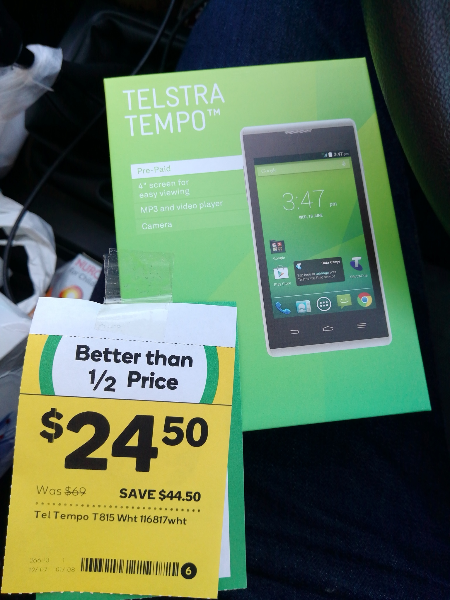
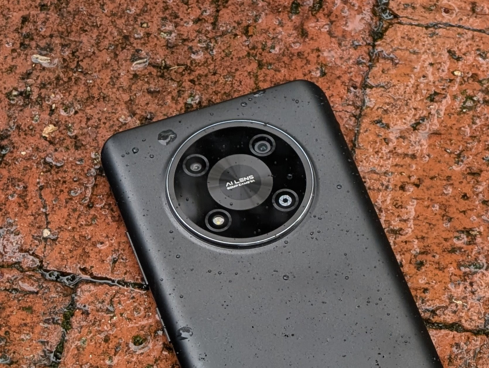

10 years ago if I told you that you can go to your nearest Woolies, which may not be that close if you live outside Australia, and purchase a very usable, low-end midrange phone for just $29, you would laugh in my face. That is because 10 years ago, the best you'd be getting is one of these:

- 4GB Storage
- 512MB RAM
- Android 4.4
- Crappy Mediatek something
- A camera that takes photos (not good ones)
- Thoughts and prayers
- Some of them came with a free $20 Google Play gift card

Today however? Completely different, and it's scary. For just $29, I was able to purchase a brand new Optus X Pro 5G from my local Woolies, and unlike most phones that cost $29, this is genuinely usable.

Now, the unboxing experience isn't much, it's a bright yellow Optus box, and the phone is just loosely placed inside in a paper bag, but you also get a charging brick in the box which is nice, even if it's only a 10W USB-A brick. The design is nothing to call home about, the front looks like every budget phone ever made, and the back, is, well, certainly a design. Personally not a huge fan of the AI LENS 50MP CAMERA written right in the middle, the fake fourth camera lens that is just a camera icon and one of the cameras being the flash, but for $29, you're also getting two real rear facing cameras, even if only one is good.

"But, if I just complained about all of that, why is the title "Budget phones are so scarily good now I am writing a blog post about it", is this clickbait?" You may be asking. "Why did you put quotation marks inside quotation marks, you can't do that," you may also be asking, so here's everything I find genuinely impressive about this phone for $29. This entire post is actually more of a review than an opinion but oh well.

## The performance is just good
There really is nothing to complain about performance wise. It's a $29 phone. It performs slightly faster than a Galaxy S9 and slightly slower than a Galaxy S10 (Exynos variants specifically). Combine that with ZTE's rather lightweight MyOS 14 skin, and it feels incredibly snappy. Apps open almost instantly, there's minimal lag and framedrops and it's overall just nice to use. If you had me pick between a Galaxy S9 and this phone and I had to pick purely based on performance, I would pick this phone. 

The Unisoc T760 in this phone is more than capable for basic tasks, and unless you plan on gaming or video editing or doing any other intensive task on this phone, it is just so hard to complain. Budget phones used to SUCK here, they would have horrific, slow, laggy software and a CPU with equal power to that of a SIM eject tool, very little RAM (more on that shortly) and bloatware.

As for this phone, while it certainly doesn't have heaps of RAM, at only 4GB, in my testing 4GB is still quite usable as long as you aren't trying to multitask between apps. The only frustration I've had with 4GB of RAM is trying to copy 2FA codes sent to my email, but opening the email app closes the app I was just in.

Unlike other budget phones, it also does not come preloaded with a single bloatware app! That is, except for the Optus app of course, which is installed as a standard user app so you can just uninstall it.

To test performance, I ran the 1080p60 benchmark test in my app, [Compressor](https://github.com/JoshAtticus/Compressor#performance), the best video compressor for Android and you can't tell me otherwise, which results in a nice score of 6s and 89ms, slightly faster than the Galaxy S9 but slightly slower than the Galaxy S10.

## The screen is just good
Okay, that's a bit of a stretch maybe for a 720p screen, BUT, it's a real IPS panel, not a crappy TFT, or god forbid, Samsung's horrible PLS panels they use on their ultra-budget phones (like the Galaxy A05s I got for $49 but did not write a blog post about because there is nothing remarkable or exciting about it). Not only is it a real IPS, but it's 90hz! And thanks to it's just good performance, it can actually sustain and run at 90hz!

## One of the cameras are just good
It's the main camera. The rest are dogshit. Do not touch them ever. It's shockingly good at macro photography, rivaling even my Pixel 8 Pro.

## The battery is great
Low power consumption SoC + big 5000mAH Battery = long battery life

Slightly concerningly however, the battery came with 210 charge cycles from factory...

## IT HAS A NOTIFICATION LED
Literally my favourite feature ever. Please bring this back big companies.

## Surprisingly decent software support
While you're not going to get anything newer than Android 14 on this thing, ZTE does seem to keep up fairly well with security patches, releasing them every 3 months, although the most recent one is December 2025 and there hasn't been any updates past that so far.

I will absolutely use this point to highlight that unlike iOS 17 which also released in 2023, Android 14 will remain usable far longer than any old iOS version thanks to far better app support and continuous support from Google. Android 6 was still usable until recently, although I wouldn't use anything older than Android 8.

## Conclusion
Don't buy a budget phone. But also, if you want a budget phone, they're not manufactured landfill anymore.