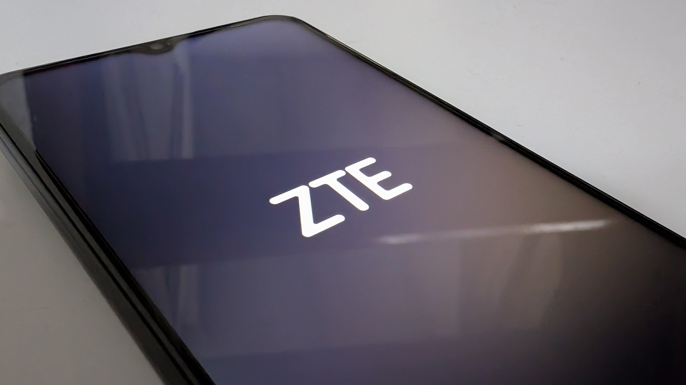
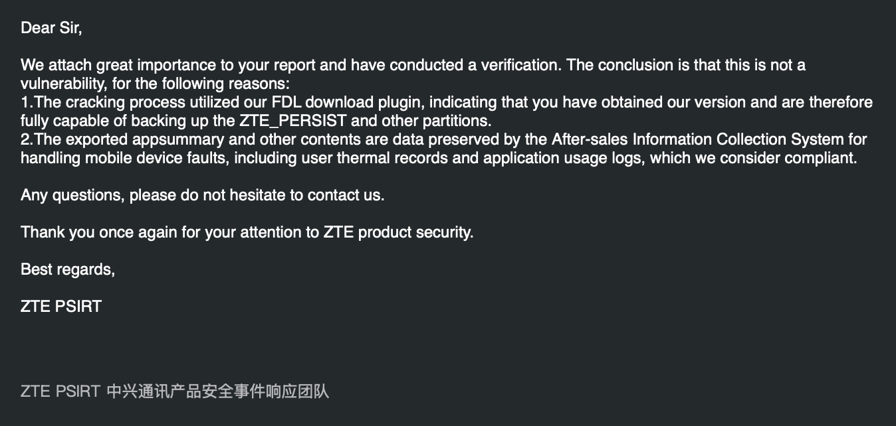
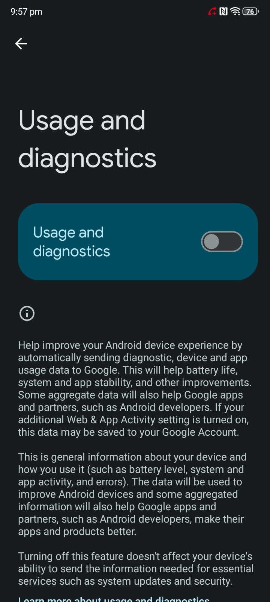

In a [previous article](/posts/2026-05-15-budget-phones-are-scary), I wrote about budget phones being insanely good compared to 10 years ago. Specifically in that post, I took a look at the **Optus X Pro 5G**, which is actually just a rebranded **ZTE Blade A73 5G**. 

There are many other carriers outside Optus (owned by Singaporean telecommunications company *Singtel*) that use rebranded ZTE phones, including Telstra, Vodafone, T-Mobile, Verizon, AT&T, Orange, TracFone, Boost, Deutsche Telekom etc. My point is, these phones are widespread. People buy carrier branded phones because they're cheap, unless you're me, in which case I buy them whenever they go for a good enough clearance price just to laugh at how terrible they are. 

I digress, while you shouldn't really be expecting *privacy* per se on any budget phone in general (Samsung was caught pre-installing Israeli spyware AppCloud on their budget phones, and Nothing even put ads on the lockscreens of their cheaper models which was also spyware, although they later removed this), where ZTE is really crossing the line is **recording a detailed log of every single app opened at what exact times allowing for the creation of a list of all installed apps**, also allowing them (and anyone with access to the device, more on that later) to **map out your entire daily routine** because they also **log every single charge cycle** and **every single firmware update installed**.

Creepy stuff.

So how did I find this? I got bored and wanted to gain root access, but accidentally started this side quest while trying to do so (and I have not successfully gained root yet). It started with another vulnerability, CVE-2022-38694. I'm not an expert, but this vulnerability allows you to flash stuff, dump stuff, unlock bootloaders etc on affected Unisoc chips, which usually isn't possible as Unisoc doesn't allow for any of that. 

It's through this that I discovered a partition on the device, **ztepersist**. At first, I thought it might be similar to the persist partition found on all Android devices, which contains things like calibration data for sensors and MAC addresses. Taking a look in a hex editor however revealed something entirely different, the names of apps installed, and a log of when each app was used. 

I needed to dig deeper though, sifting through the 32MB partition in a hex editor would be time consuming, so I made a quick script to parse the ztepersist partiton dump the data from it in a readable format. Doing this revealed something **scary**, this wasn't just the data from today, or the past 72 hours, or even week, this was data not only from when I had purchased the phone, but even before I had purchased the phone, showing the testing app they used for QA at the factory.

A quick factory reset later to confirm my suspicions, and yep, this log, of ALL your activity, seemingly never deleted, persists across factory resets. I dug further, thinking "surely there's more if this is some sort of diagnostics partition," and sure enough, there was. The following information is stored in the ztepersist partition:

- A full log of all apps used (which can be used to create a list of installed apps)
- OTA Update/Firmware Update history (build number, old build number, firmware version, install date & time, update type)
- System boot count, Recovery boot count, App Not Responding count, Crash Report count
- Total system uptime, total time charging
- Total time charging the phone at 45 and 50+ degrees celsius powered on and powered off
- Battery charge cycles (date & time device started charging, fast or normal charging, time charging in m but sometimes just a random number, battery percentage when charging started and ended, minimum battery voltage, maximum battery voltage, minimum battery current, maximum battery current, minimum temperature and maximum temperature in celsius)

The worst part? Combined with CVE-2022-38694, all of this can be obtained by an attacker with physical access to the device in under 45 seconds. The data is stored without encryption, meaning the screen lock is not required to access the data. Furthermore, as ZTE devices do not require the screen lock to be entered to power off the device, this data can be extracted from any device state by just powering off the phone without authorisation.

Requiring the screen lock to power off the device would not be a suitable fix for this issue, as an attacker with extended access to the device can simply wait for the battery to drain to enter Unisoc BROM mode, or hold the force reboot keys, immediately release them when the screen turns off and quickly connect a charger to enter offline charging mode, before disconnecting the charger to power off to enter Unisoc BROM mode.

Here is my Proof-of-Concept video (the first 1:33 is simply showing normal operation of the device, you can skip it if you want):

[[youtube: hQu5yfHhMBg]]

## Responsible Disclosure
On May 16, 2026, I attempted to disclose this issue responsibly to ZTE PSIRT's dedicated responsible disclosure email. ZTE's response?

1. Not a vulnerability
2. Apparently I used their FDL download plugin, which makes me capable of extracting the data (the first part of which is not true, I am using a publically available exploit and chaining it)
3. The data is preserved **on purpose**, because it's "important" for after sales support, essentially confirming that this spyware is **intentional**. ZTE called this "compliant."

I followed up with ZTE, trying to explain that this is a vulnerability, but got no response, which is why I am going public with this information. 

More devices are affected, I did a search on Google for "ztepersist partition" and found these devices that have the partition. It may or may not contain the same information, but likely does.

- ZTE A31 Plus
- ZTE A35E
- ZTE Blade L8
- ZTE Blade L9
- ZTE Blade A52
- ZTE Blade A33+
- ZTE Blade A54
- ZTE Blade A56
- ZTE Blade A72
- ZTE Blade A73 5G (my tested model)
- ZTE Blade V40 Smart
- ZTE nubia v60 Design

There are almost certainly more than this, these are only devices I was able to find proof of containing this partition. All of these are Unisoc phones.

Now, back to ZTE's response. Remember how they said that this behaviour was compliant? Well to nobody's surprise, it isn't, especially under CCPA or GDPR. Even if the user explicitly disables Usage & Diagnostics data collection, the device continues to record this invasive logging data to this partition, which can't be cleared easily. Disregarding the invasiveness, simply continuing to log even after the user disables it is enough to violate privacy laws in many countries and regions.

As for invasiveness?

- It survives a factory reset, making it a privacy issue if you sell or give away your device
- A log of every app you use and when as well as when you charge your phone could be used to create a map of your entire daily routine ("We kill people based on metadata." - Michael Hayden, former Director of the NSA and CIA)
- The data should not be collected in the first place if the user has disabled usage and diagnostics data. The users also are not informed that any of this is happening
- The data is stored in an insecure way
- ZTE admits their own support team accesses all this data if you send your phone in for repair

If you'd like to try this on your own phone, you can see my Proof-of-Concept code on GitHub: [https://github.com/JoshAtticus/ztewaste](https://github.com/JoshAtticus/ztewaste)