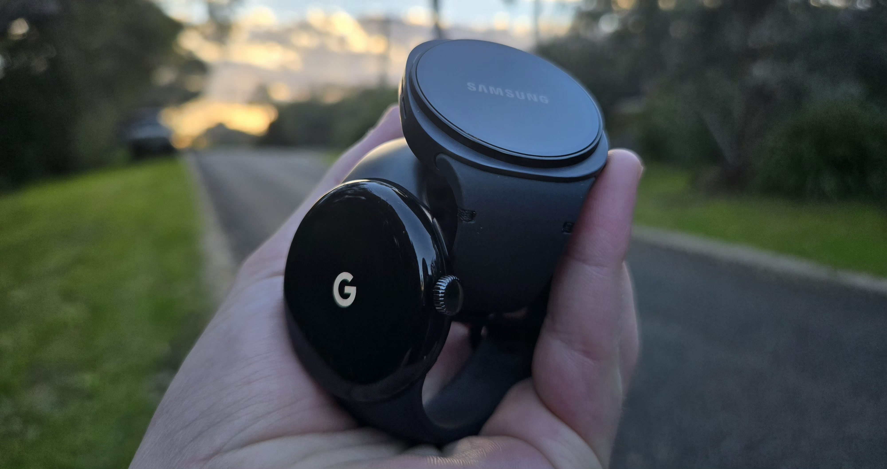
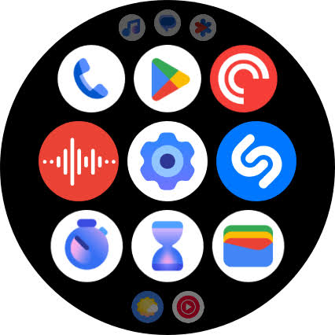

When the Pixel Watch launched in 2022, I was sold instantly. I didn't even need to see reviews, all I knew is that I wanted one, no, I **needed** one, and honestly, I still completely agree with my reasoning at the time.

The hardware looks absolutely gorgeous. While companies like Apple were making ugly square watches that just don't look that sophisticated and very much prioritise functionality over form, and Samsung was doing, well, whatever the fuck Samsung felt like doing (crack probably), Google put out a smartwatch I actually *wanted* to wear. The glass dome design was absolutely beautiful, I didn't even care about the absolutely massive bezels, or terrible battery, or, as fate would have it, terrible software.

See, Google has an on-off relationship with wearables, and more specifically, its dedicated version of Android for wearables, called Android Wear. First released in June 2014 for the LG G Watch based on Android 4.4 KitKat, it was, disappointing to say the least. Sure it was made specifically for wearables, but when it first launched, it didn't even have *fitness tracking* or *watch faces*, one of the most basic features of any smartwatch today. 

Wait a few months and out comes Android Wear 1.0 in December 2014, based on Android 5.0.1. It adds a lot of functionality, and Google continued to develop Android Wear, at a highly variable pace. 2015 and 2016 brought about highly basic smartwatch features like WiFi, wrist gestures, notifications and support for onboard speakers, in 2017 Google released Android Wear 2 based on Android 7.1.1, which added the Play Store to a smartwatch officially for the first time, March 2018 brought the rebrand to Wear OS, the name we know today, where Google also reset the versioning to 1.0. It's believed the rebrand from Android Wear to Wear OS was mainly to appeal to iPhone users.

Later the same year, Wear OS 2.0 comes out. It adds much of the UI we know today in modern Wear OS, tiles, swipe navigation, etc, and then development sort of just stopped. There was no market for Wear OS. Nobody was really making serious Wear OS watches, and those who did didn't see much traction. Fossil, the only company that truly cared about Wear OS, carrying it through its dark ages, ended up leaving the market later on, which shows how Google really doesn't care that much about third party Wear OS manufacturers.

Just 2 years later in 2020, development stopped. Google gave up. Nobody really cared about Wear OS, not even Google themselves. The problem was just how much Wear OS lacked. Released in 2018, Google very slowly added new incremental features through 2019 and 2020, but clearly it wasn't enough. Samsung chose not to use Wear OS for their Galaxy Watch series, including the highly popular Galaxy Watch Active2, selling millions of units globally and easily outperforming individual specific model lines running Wear OS 2. Instead, companies like Samsung chose to use proprietary operating systems like Tizen.

By 2021, Google basically gave up. Wear OS 2 was essentially abandoned. Google crawled back to *Samsung* of all companies, the one company that *didn't* use Wear OS, and rightfully so, because it was a stinking pile of garbage and an inconsistent mess continuously built upon and progressively made worse over the years.

The same year, Samsung finally decided to ditch Tizen, partnering with Google to make Wear OS 3, which was essentially a complete rewrite of Wear OS based on Android 11. 

Samsung launched the first Wear OS 3 watch in 2021, the legendary Galaxy Watch4. Honestly still a great watch today, if it still got software updates. The design was meh but it was popular, and that's what Google needed to help boost the popularity of Wear OS once again. 

An important distinction was that the Galaxy Watch4 didn't run plain Wear OS 3, it ran One UI Watch 3.0, Samsung's much more feature-rich, complete and consistent software layer on top of a Wear OS 3 core.

More time passes and it's now 2022. Something exciting is coming, an official Google Pixel Smartwatch. 

On the outside, again, it looks, *great*. On the inside, it also looks, *not great*. On the inside, again, it also looks, *pretty actually terrible*.

In a move that perfectly summarises Google's entire hardware team, they powered this brand-new, cutting-edge 2022 smartwatch with an *ancient* Exynos 9110 chip from 2018, the same one that shipped with the very first Galaxy Watch, known well for its bad battery life and efficiency.

Not only did they take this ancient chip from 4 years prior, they had the *audacity* to pair this chip with a 41mm housing and an absolutely tiny battery. When I got my Pixel Watch, the battery was so bad I thought it was broken. If you didn't use the watch at all with AOD off, it would last from when I woke up until I had a shower at night. If you *did* use the watch at all, even with AOD off, you'd get a lot less than that.

Google picked a horribly inefficient chip, paired it with a tiny battery, and to top it off, Wear OS 3 was *horrendously* unoptimised.

Now I understand that this was a first generation product, and Google's newer hardware is significantly improved, adding better batteries and more efficient chips, but what hasn't changed is the awful software.

Beyond the inefficiency, Wear OS 3 felt horribly incomplete. It just lacked basic features, just like early Android Wear. If you take a look at an AOSP Android Phone Emulator Image and a Pixel phone, the difference is night and day. The AOSP image is incomplete and lacking features and good UI, while Google has actually put effort into making the Pixel UI usable. Do the same for the Pixel Watch, and the differences are far less obvious. Sorry, let me correct that, there are zero differences. There are absolutely zero special Pixel Watch features that make it look better or more complete than the barebones basic AOSP Wear OS image. This statement is true for all versions of Wear OS.

Rather than trying to explain the differences, I think it would be better to just show you.

[[compare: assets/2026-08-19-actually-i-dont-hate-smartwatches-i-hate-google/apps_oneui.png | assets/2026-08-19-actually-i-dont-hate-smartwatches-i-hate-google/apps_wearos.png | Wear OS vs One UI Watch - Apps Launcher]]

Take a look at the Wear OS apps launcher. What do you see? Exactly, you see an inconsistent mess, where Google somehow couldn't even put a background on their own icons, leading to the icons being too big, not centered, and some of them are actually too big and go out of the safe zone. One UI Watch on the other hand *doesn't*. Samsung has actually put *some* degree of care into making the icons look diverse and consistent.

Not pictured here, but there are 4 different icon design styles at play throughout Wear OS. Some of the icons are still exactly the same as Wear OS 3, some of them are the same as Google's newer design style, some are Material 3 Expressive, and some are, well, who knows what because they definitely don't fit in.

Even in Wear OS 6.1, screenshots online *including from Google themselves* still show clashing, inconsistent icons throughout the apps launcher. How hard is it to just get the icons right everywhere? Samsung's been doing it since the beginning, why can't Google after *all this time*?

[[compare: assets/2026-08-19-actually-i-dont-hate-smartwatches-i-hate-google/qs_oneui.png | assets/2026-08-19-actually-i-dont-hate-smartwatches-i-hate-google/qs_wearos.png | Wear OS vs One UI Watch - Quick Settings]]

Take a look at the Wear OS quick settings. What do you see? What I see is a completely uncustomisable, rigid and uneditable quick settings panel that hasn't changed a bit since Wear OS 3. Now change isn't necessarily a good thing, but here it's certainly needed. There is *still* no way to toggle WiFi, no way to remove the find phone button that's all too easy to accidentally press, no way to adjust volume, no way to toggle NFC, no way to toggle location, no way to quickly connect Bluetooth headphones. All of these things I'd consider essential. One UI Watch has them, Wear OS doesn't.

I know that Wear OS 6 has come out and changed the *UI*, but it hasn't added/fixed any of these requirements for me, and you still can't edit the layout like you can on One UI.

So what am I trying to get at here? From everything I've said so far, you should be able to infer that I *love* the look of the Google hardware, but what frustrates me is how little effort Google seems to be putting into software.

It's like the different departments that make the components of Wear OS, the system, the UI, the apps, they're all trying to sabotage each other.

In 2021, Google bought Fitbit. "Great!" one might think, "that'll provide an excellent fitness feature set for the Pixel Watch," one might think. Except it wasn't, because in typical Wear OS fashion, the Pixel Watch Fitbit implementation was completely unharmonious with the entire rest of the watch. It felt a lot less like Google bought Fitbit to have good fitness features on their upcoming watch, and more like Google bought Fitbit so they could stick it to the back of their upcoming watch with a hot glue gun and duct tape.

Instead of building one cohesive health app for the Pixel Watch, Google created a fragmented mess. You need a Fitbit account, but also maybe Google Fit, and then they locked basic features (like Readiness Scores or advanced sleep tracking) behind a Fitbit Premium subscription on a watch you already paid hundreds of dollars for.

By the time Google finally decided to actually make Fitbit usable on the Pixel Watch, they literally had to rename it to Google Health so people would actually care about it. Oh and in the process of doing so, somehow deleted the background of the icons so they all look like crap, and they *still* haven't fixed it.

Samsung on the other hand? Samsung actually puts a purpose-built fitness and health tracking suite on their watches. It's built well (except the mobile app, what on earth are they doing there), is integrated into the OS cleanly and not just tacked on as an app, has significantly more features than Google Health/Fitbit, and best of all, there's no subscription! Because yes, 4 years after the first Pixel Watch, Google Health/Fitbit is *still* paywalling features like Sleep Score behind a ridiculous subscription fee.

Did you know you *still* can't do or track the following with a Pixel Watch/Google Health?

- Manual Blood Oxygen measurements
- Mood check-ins
- Sound exposure
- Body composition

And then features like Vitals tracking and so many other features that Apple and Samsung have had for years took until earlier this year to be added. Google is so far behind in quite literally just *everything* that it's not even funny.

I want to love the Pixel Watch, because I don't like how Apple or Samsung watches look, and I love how Pixel Watches look, but how can I possibly keep buying Pixel Watches when we're up to the fifth generation and we've seen practically zero improvement in software.

Recently, my Pixel Watch battery started failing. The resale value of them is so poor that it would be more expensive to replace the battery than to just buy a whole used watch. I wrongly came to the conclusion in [this article](https://blog.joshattic.us/posts/2026-05-14-fitbit-inspire-3) that the problem wasn't Google, it was just smartwatches in general. I got my Galaxy Watch9 preorder a few days ago. At first I thought I wouldn't like it, the design is meh, but the software upgrade is simply one so large I can never see myself switching back to a Pixel Watch ever again.

Wear OS 3 was supposed to be a new leaf for Google, but they didn't hold up their end of the software. They continue to release beautiful looking watches running downright bad software that lacks in everything, while on the otherhand, Samsung has pretty much replaced every single part of the Wear OS UI with their own One UI Watch skin, and it is just *years* ahead of where Google is at, and the closest I think Android watches will ever get to the incredible Apple Watch software.

I'm sure I don't have much impact over what happens at Google, but every update Samsung and Apple releases for their watches just leaves Google behind in the dust. The gap between Samsung and Google in terms of smartwatches is even bigger than where it was back in 2018 when Samsung was still using Tizen.