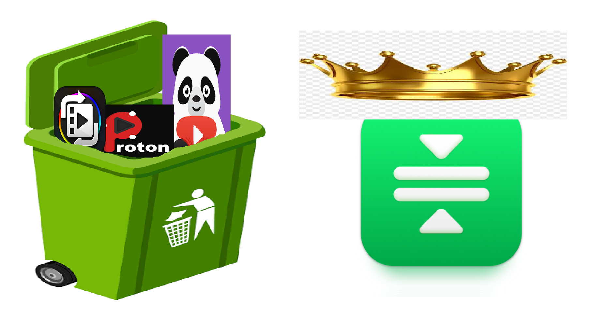

Back in February, I benchmarked my video compression app for Android, [Compressor](https://compressor.joshattic.us), against every Android video compressor app I could find, and, to nobody's surprise, it won. Competitors have now had just over 7 months to respond, and with Compressor approaching 100,000 downloads you'd think *someone* would have caught up. So, of course I wasted around an hour of my life testing the biggest competitors on the same device, the same videos, and the same methodology.

Spoiler: nobody caught up. [Full results are here](https://compressor.joshattic.us/benchmarks). Actually, they got worse, because with Compressor 1.6.4, it's even faster than before, especially on Android 13+.

## The setup

Exactly the same as last time, except this time I came into it with a lot more free time and patience and a hard cap at wasting 5 minutes of my life per test (because I am NOT waiting another 21 minutes for the easiest test in Panda Shit Compactor, god I don't even want to know how bad 8K would be).

- Pixel 8 Pro
- 21 degrees celsius room temperature
- Phone plugged in for all tests at 100% battery
- Same 4 test videos across all apps
- 1080p Medium Preset

## The results

| App | 4K60 | 4K30 HDR | 8K24 | 1080p60 |
| --- | --- | --- | --- | --- |
| **1. Compressor** (free) | 10.55s | 6.38s | 15.51s | 4.45s |
| **2. Compressor Edge** (free) | 10.58s | 6.45s | 15.85s | 4.51s |
| **3. Squeezio** (IAP) | 14.11s | 10.00s | 17.15s | 6.24s |
| **4. Squish** (IAP) | 14.73s | 10.27s | 20.49s | 6.55s |
| **5. Video Compressor & Video Cutter** (ads) | 21.87s | 13.09s | 22.85s | 11.51s |
| **6. ShrinkVid** (ads) | 22.13s | 15.89s | 23.34s | 14.35s |
| **7. Video Compressor: Reduce Size** (ads) | 1m 48s | 57.28s | 1m 54s | 32.24s |
| **8. Video Converter, Compressor** (ads) | 2m 16s | 1m 02s | 2m 49s | 48.01s |
| **9. Compress Video Size Compressor** (ads) | 2m 21s | 1m 04s | 4m 57s | 30.05s |
| **10. Proton Video Compressor** (ads) | 2m 37s | 2m 33s | 4m 44s | 38.34s |
| **11. Video Compressor & Converter** (ads) | 2m 56s | 1m 09s | FAILED | 34.56s |
| **12. Compress Video - Resize Video** (ads) | 4m 21s | 1m 43s | FAILED | 50.12s |
| **13. Compress Video - Size Reducer** (ads) | 3m 11s | 3m 56s | FAILED | 29.78s |
| **14. Video Compressor - Reduce Size** (ads) | 4m 19s | 4m 24s | FAILED | 25.89s |
| **15. Focus Video** (ads) | FAILED | 1m 33s | FAILED | 43.60s |
| **16. FFShare** (free) | FAILED | CRASHED | FAILED | 1m 09s |
| **17. Panda Video Compress & Convert** | FAILED | FAILED | FAILED | FAILED |

Compressor compresses a 4K60 video in **10.55 seconds**. Several competitors took over 4 minutes for the same file. When it comes to 8K, the ones with really shit ffmpeg implementations explode of being being shit themselves, and when the 7.5 minute penalties are applied, Compressor comes out up to **101x faster** than the slowest competitor, Panda Video Compressor. Or should I say, Panda TIME WASTER. Literally had to go and leave a one star review on that one. One hundred and one. ONE HUNDRED AND ONE TIMES SLOWER THAN COMPRESSOR. HOW DO YOU MAKE SOFTWARE THAT BAD?!?!?!

## Why is it still this bad?

These apps aren't even **trying** to be good. They're purposefully bad, because the longer they make you wait, the more stupid video ads they get to show you! But some of these apps go further, at least THREE offered me a paid subscription to increase performance and remove ads, which is just insanity. During testing I experienced 15-30 second video ads before, during, and after compression, a $22.99 PER **WEEK** subscription (that is almost $100 per month, or $1200 per year, for a VIDEO COMPRESSION APP), 30-second ads every third tap (this was SO ANNOYING), and full-screen gambling, alcohol, and dating ads while the app was doing nothing useful. One app timed its ads so that watching them took longer than the compression itself 💀.

The apps that *aren't* ad-riddled mostly monetise with paywalls instead. When they don't have many ads, they lock 4K output, manual settings, hardware acceleration, or even *saving YOUR OWN compressed videos* behind IAPs and/or subscriptions.

Meanwhile the top two spots are both free, MIT-licensed, offline, with zero ads and zero telemetry. This is because I made them so they're good and not bad. Compressor uses the native hardware encoder on your device instead of software-accelerated libraries like ffmpeg. Because Compressor is completely free with no ads, I don't *need* to deliberately make my app slow so you watch more ads. Compressor is the fastest because I wanted it to be that way.

The one honourable mention is FFShare. It's free, open-source, has no ads, no IAP, just like Compressor, but ffmpeg is the problem. It gives you no options, is super slow, crashed on HDR video, and timed out on 4K and 8K.

Oh and also honourable mention to Squeezio and Squish, I think they're the only ones using Media3 like Compressor. They're both seemingly pointless alternatives to Compressor (for, whatever reason?) with not many downloads. I tested Squeezio because the creator had the audacity to add themselves as an alternative to Compressor on AlternativeTo (what a narcissist) and Squish because it's very obviously Claudeslop and it even has a toggle in app to "Enable Pro".
 
## Try it yourself

The baseline videos are [downloadable](https://l.joshattic.us/mDAc6J) (CC BY-NC-ND), the [full methodology and head-to-head comparisons](https://compressor.joshattic.us/benchmarks) are up, and both apps are on [Google Play](https://play.google.com/store/apps/details?id=compress.joshattic.us) and [IzzyOnDroid](https://apt.izzysoft.de/packages/compress.joshattic.us), with source on [GitHub](https://github.com/JoshAtticus/Compressor).